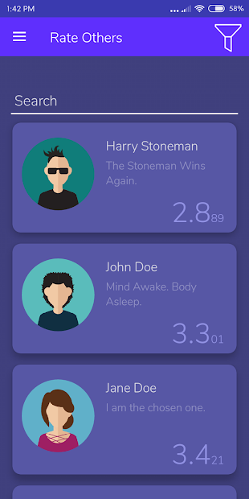
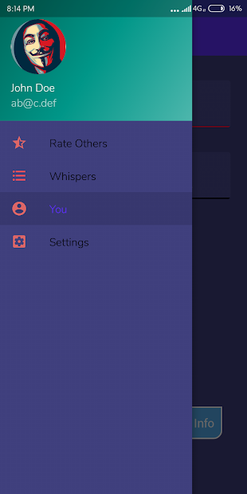
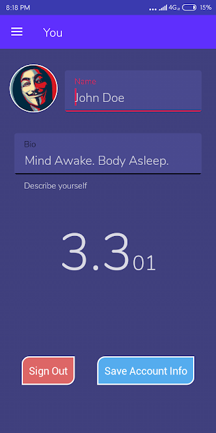

# StarSociety

[Download or View on Google Play](https://play.google.com/store/apps/details?id=info.adi.starsociety)

StarSociety is an app which allows you to Rate Others Daily and Send Anonymous Whispers.
Others can also view and rate you.
You should rate others on how they behaved towards you today and how their attitude is in general. DO NOT RATE OTHERS TO HURT OR DEMEAN THEM.

This app was inspired from the shows Black Mirror and Community.
I created this app as a hobby. This is a preview/beta build and I advise you to keep that in mind while using the app.
Please use this App Construcively.

This app was built using Kotlin.

## Screenshots

&nbsp;&nbsp;
&nbsp;&nbsp;

